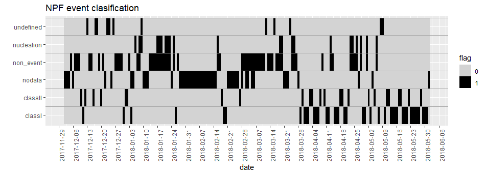
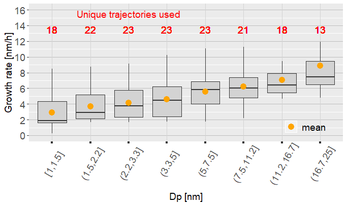
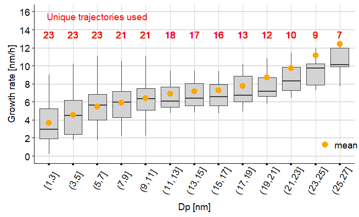
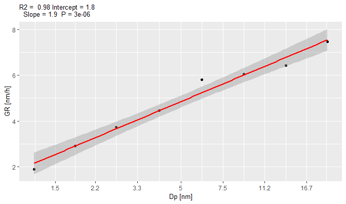
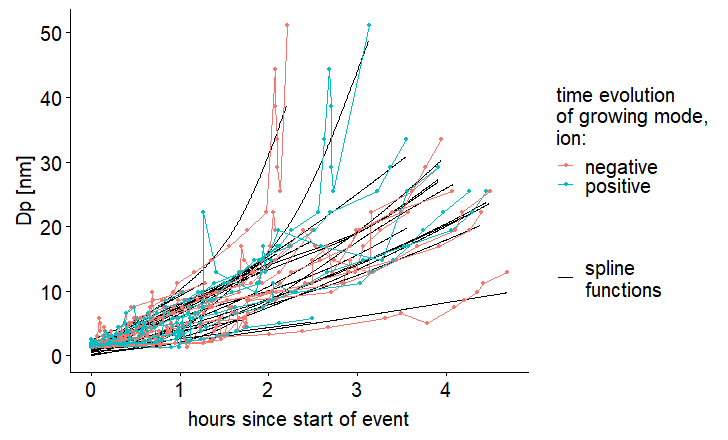
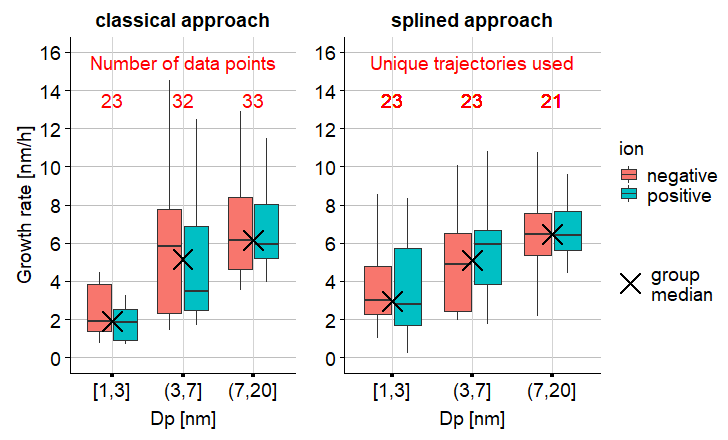
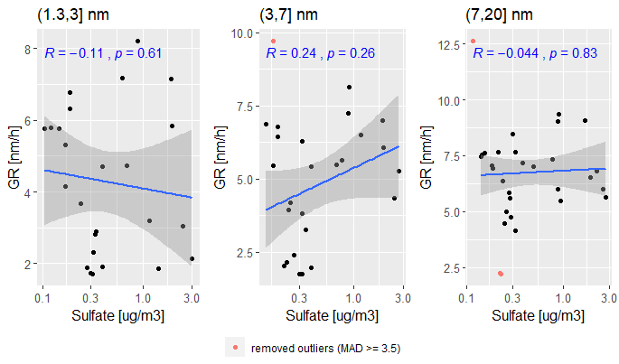
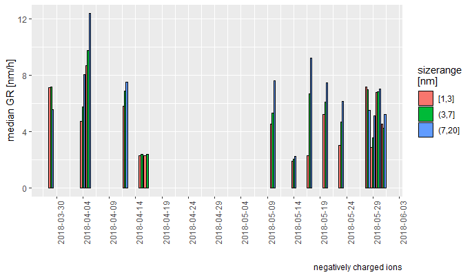

<!-- $theme: gaia -->
<!-- page_number: true -->
<!-- footer: Bolivia Meeting - Helsinki 2019.06 -->

# Growth Rates at CHC 
- Alkuin Koenig (Max)
- Diego Aliaga

     - data, results and further information at: 
      [https://github.com/daliagachc/GR_chc/](https://github.com/daliagachc/GR_chc/)

---
#### NPF event clasification

###### based on Maso, M. D. et al. Formation and growth of fresh atmospheric aerosols: eight years of aerosol size distribution data from SMEAR II, Hyytiala, Finland. 10, 15

---

___

[https://github.com/daliagachc/GR_chc/blob/master/Rproject/results/files/GR_CHC_splined_approach_all_events.csv](
https://github.com/daliagachc/GR_chc/blob/master/Rproject/results/files/GR_CHC_splined_approach_all_events.csv)

---

Linear correlation bewteen GR and $D_p$ [nm]

---

- methodology used to derive the growth rate using splines
---

- comparison between the classical approach and the splined approach
---

- no correlation with sulfates 

---

- GR values for event days divided in bin sizes 1-3, 3-7, 7-20 nm

